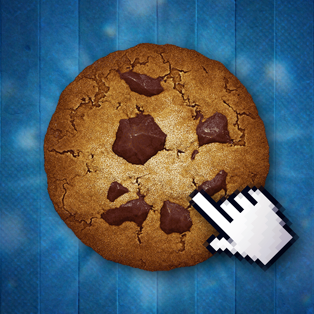
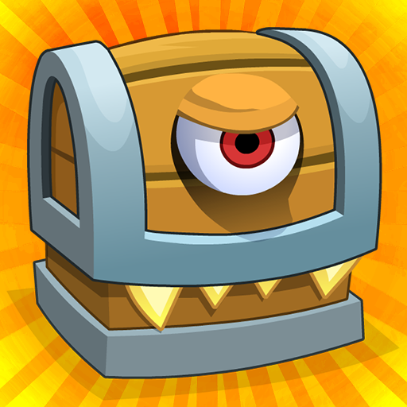
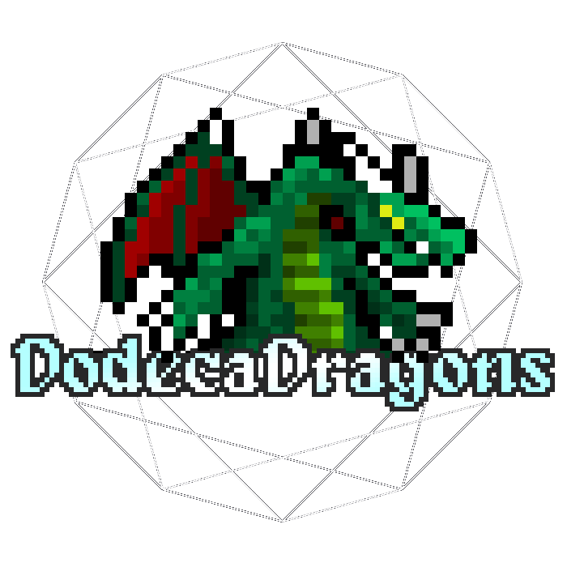

# Incremental Games Save Decrypt & Encrypt

A tool for decrypting and re-encrypting save files from incremental/idle games.

**[Open the tool](https://davidts93.github.io/idle-save-crypt/)**

## Supported Games

-  Idle Research
-  Cookie Clicker
-  Cookie Clicker (Web)
-  Exponential Idle
-  Antimatter Dimensions
-  Idle-Squares
-  Scratch Inc.
-  Clicker Heroes
-  Shark Incremental
-  DodecaDragons
